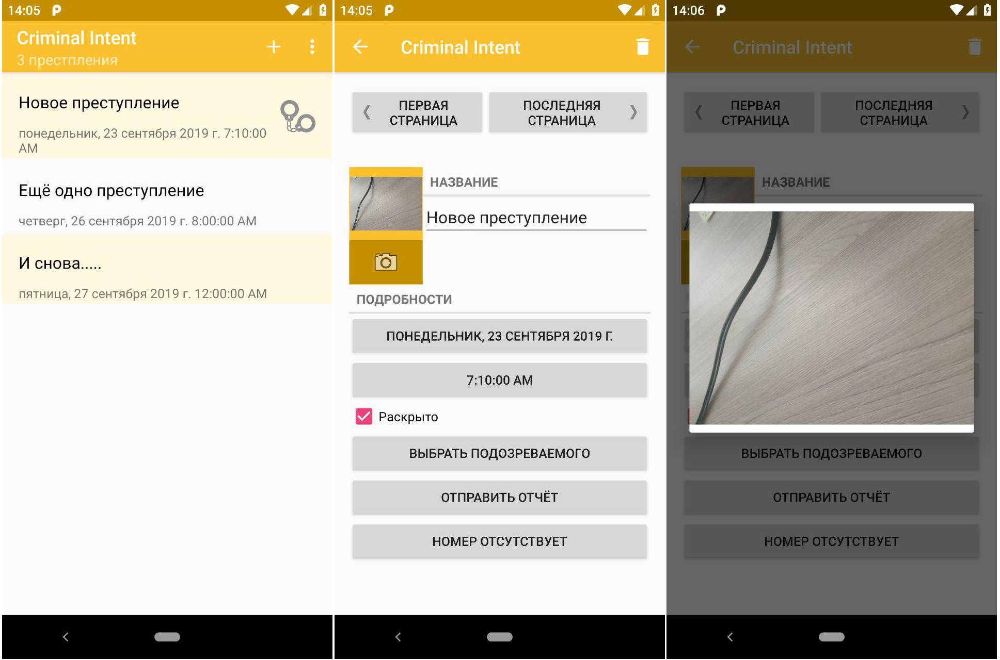
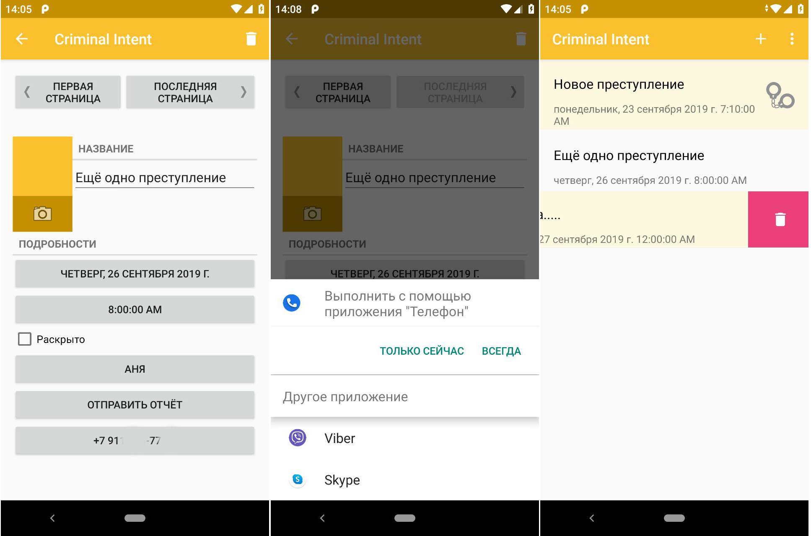

Criminal Intent

================
Criminal Intent application from the book Android Programming The Big Nerd Ranch Guide

Description
------------
In the criminal intent app, the user can create a crime record with title, date and photo.
You can also select a suspect in the contact list and send a complaint by e-mail, publish
in other applications. So reporting a crime, the user is released from the negative and can
focus on the current task.

Short review
-------------

